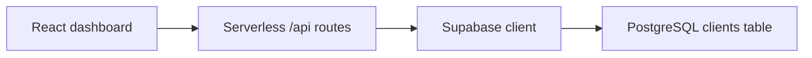

# Mortgage Operations Dashboard

A full-stack internal-tool prototype for mortgage client intake and application workflow tracking. The React interface communicates with serverless API routes that persist records in Supabase PostgreSQL.

## What it does

- Creates client application records with required-field validation
- Displays live summary counts for total, new, in-review, and approved applications
- Filters the application pipeline by status
- Updates an application's workflow status
- Tracks mortgage type, follow-up date, and internal notes
- Deletes records through the API
- Presents the workflow in a responsive business-dashboard interface

## Architecture



## Technology

| Layer | Tools |
|---|---|
| Frontend | React 19, JavaScript, Vite, CSS |
| API | Vercel-style serverless functions |
| Database | Supabase PostgreSQL |
| Local tooling | npm, ESLint |

## API routes

| Method | Route | Action |
|---|---|---|
| `GET` | `/api/clients` | List clients, newest first |
| `POST` | `/api/clients` | Create a client |
| `PATCH` | `/api/clients/:id` | Update status, notes, or follow-up date |
| `DELETE` | `/api/clients/:id` | Delete a client |

The API maps database snake_case fields to frontend-friendly camelCase responses.

## Run locally

### Requirements

- Node.js
- A Supabase project with a `clients` table
- Supabase project URL and anon key

```bash
git clone https://github.com/aryan880/mortgage-dashboard.git
cd mortgage-dashboard
npm install
```

Create `.env.local`:

```bash
SUPABASE_URL=https://your-project.supabase.co
SUPABASE_ANON_KEY=your-anon-key
```

Run the frontend and serverless routes together with the Vercel CLI:

```bash
npx vercel dev
```

For frontend-only development, use `npm run dev`; CRUD operations still require the API routes.

## Scope and security

This is a portfolio prototype, not a production mortgage system. It does not yet include authentication, authorization, audit logging, soft deletion, or production-grade handling of sensitive personal data. Use only fictional test data.

## What this project demonstrates

- Translating a business workflow into an internal-tool UI
- React state, effects, forms, filtering, and API integration
- Serverless CRUD endpoints backed by PostgreSQL
- Consistent data mapping between UI and database models
- Honest identification of production-readiness gaps

Built by [Aryan Sawhney](https://github.com/aryan880).
